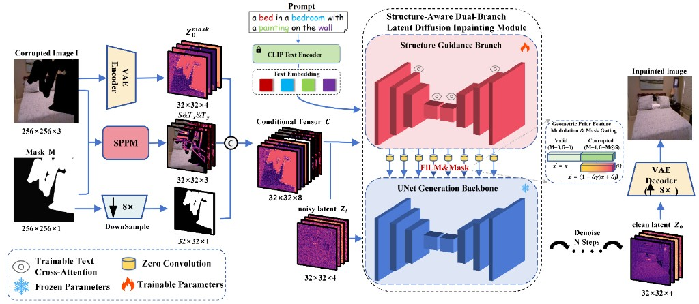
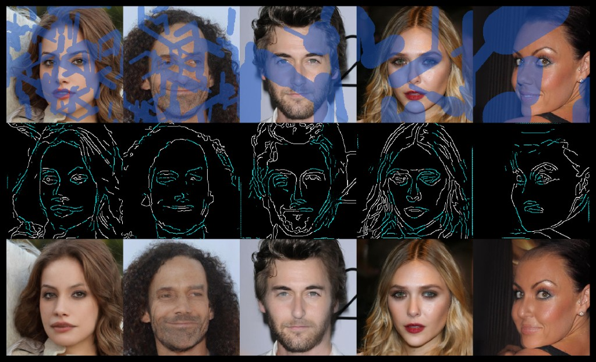
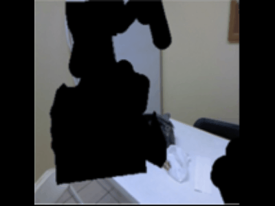

# ConDiF: Confidence-guided Direction Fields for Structure-aware Diffusion Inpainting

[](https://www.python.org/downloads/release/python-380/)
[](https://pytorch.org/)
[](LICENSE)

Official implementation of **ConDiF** — a confidence-guided direction field framework for structure-aware diffusion inpainting on **indoor scenes** and **face images**.

> **Paper:** *ConDiF: Confidence-guided Direction Fields for Structure-aware Diffusion Inpainting*  
> Chen Cheng, Qu Shuyi, Qiufeng Wang\*, Jieda Wei, Jiannan Chen  
> \*Corresponding author: Qiufeng Wang

📄 [Paper (PDF)](docs/paper.pdf)

---

## Release status

| Component | Status | Location |
|-----------|--------|----------|
| **ConDiF model & inference pipeline** | ✅ Released | `src/diffusers/` |
| **Training code** | ✅ Released | `examples/condif/train_condif_indoor.py` |
| **Inpainting demo script** | ✅ Released | `run_condif_demo.py` |
| **Demo samples** (images, masks, precomputed `.npz`) | ✅ Released | `demo/` |
| **Pretrained ConDiF weights** | ✅ Released | [Google Drive](https://drive.google.com/drive/folders/1c2pNgxzVp7T6zOEfpuDEUhE78DZ_Stgq) |
| **SPPM structure prediction** (skeleton → confidence + direction fields) | 🔜 Coming soon | — |

> Training and inference expect **precomputed structure priors** (`.npz` with keys `S`, `Dx`, `Dy`). Sample files are in `demo/`.

---

## Datasets

We follow the **Indoor** benchmark and mask protocol from [ZITS (CVPR 2022)](https://github.com/DQiaole/ZITS_inpainting), and the **CelebA-HQ** data and mask protocol from [LaMa (WACV 2022)](https://github.com/advimman/lama).

### Indoor scenes (ZITS)

| Item | Source |
|------|--------|
| **Indoor images** | [ZITS README — Indoor dataset (Google Drive)](https://drive.google.com/file/d/1ugVvsEifcNjR5cb6w4rSaHk5YcpEICvG/view?usp=sharing) · [Baidu Drive](https://pan.baidu.com/s/11O1Q7gcn7dhjPDDUNrmodQ) (password: `hfok`) |
| **Train / val splits** | `indoor_train_list.txt`, `indoor_val_list.txt` in the [ZITS repo](https://github.com/DQiaole/ZITS_inpainting) |
| **Masks (irregular + segmentation, multiple ratios)** | Same setup as ZITS/MST: [mask archive (Google Drive)](https://drive.google.com/drive/folders/1eU6VaTWGdgCXXWueCXilt6oxHdONgUgf?usp=sharing) — use `irregular_mask_list.txt`, `coco_mask_list.txt`, and `test_mask.zip` as in the [ZITS preparation guide](https://github.com/DQiaole/ZITS_inpainting#preparation) |

Indoor training/evaluation uses **256×256** crops and mask lists referenced by ZITS (`--mask_path`, `--valid_mask_path` in their training scripts). Point `--mask_file_list` in our trainer to a text file listing mask paths in the same style.

### CelebA-HQ faces (LaMa)

| Item | Source |
|------|--------|
| **CelebA-HQ images (`data256x256.zip`)** | [LaMa data folder (Google Drive)](https://drive.google.com/drive/folders/11Vz0fqHS2rXDb5pprgTjpD7S2BAJhi1P) — download and run `fetch_data/celebahq_dataset_prepare.sh` per the [LaMa CelebA section](https://github.com/advimman/lama#celeba) |
| **Masks (Narrow / Medium / Wide)** | Generated with LaMa’s `fetch_data/celebahq_gen_masks.sh` and configs under `configs/data_gen/` — same naming as the paper: **Narrow** = `random_thin_256.yaml`, **Medium** = `random_medium_256.yaml`, **Wide** = `random_thick_256.yaml` ([LaMa mask table](https://github.com/advimman/lama#generate-different-kinds-of-masks)) |

For custom CelebA-HQ splits, you can also use `bin/gen_mask_dataset.py` with the LaMa configs above ([details](https://github.com/advimman/lama#create-your-data)).

---

## Abstract

Indoor and face inpainting require strong geometric continuity under large masks. **ConDiF** uses a **decoupled dual-branch** design: a frozen Stable Diffusion UNet for generation and a trainable **structure guidance branch** for non-intrusive prior injection. Discrete line sketches are converted into **continuous confidence fields** \(S\) and **tangent direction fields** \((T_x, T_y)\). **FiLM modulation** and **mask gating** apply structure guidance only inside corrupted regions with adaptive strength. Experiments on **Indoor** (ShanghaiTech + NYUDepthV2) and **CelebA-HQ** show improvements over LaMa, ZITS, and related baselines.

---

## Method overview

<p align="center">
  
</p>
<p align="center"><em>Figure 1. Structure-Aware Dual-Branch Latent Diffusion Inpainting Module.</em></p>

---

## Visual results (CelebA-HQ)

<p align="center">
  
</p>
<p align="center"><em>Figure 2. CelebA-HQ — masked input · structure prior · ConDiF output.</em></p>

---

## Inpainting animation (Indoor)

<p align="center">
  
</p>
<p align="center"><em>Figure 3. Indoor inpainting — masked input to ConDiF output.</em></p>

---

## Repository structure

```
Condif2/
├── README.md
├── requirements.txt
├── run_condif_demo.py             # inpainting demo
├── docs/images/                   # figures & GIF
├── demo/                          # sample images, masks, .npz priors
├── src/diffusers/                 # ConDiF model & pipeline
├── examples/condif/train_condif_indoor.py
└── scripts/check_condif_imports.py
```

---

## Installation

Tested with **Python 3.8**, **PyTorch 1.12.1 (CUDA 11.6)**, and [`requirements.txt`](requirements.txt).

This repo ships a local fork under `src/diffusers/` — do **not** `pip install diffusers` on top of it.

```bash
git clone https://github.com/CCFOR-learning/Condif.git
cd Condif

conda create -n condif python=3.8 -y
conda activate condif

pip install torch==1.12.1+cu116 torchvision==0.13.1+cu116 torchaudio==0.12.1+cu116 \
  --index-url https://download.pytorch.org/whl/cu116

pip install -r requirements.txt
pip install imgaug webdataset

export PYTHONPATH="$(pwd)/src:${PYTHONPATH}"
python scripts/check_condif_imports.py
```

---

## Pretrained models

| Model | Source |
|-------|--------|
| **SD base (default)** | [Realistic Vision V6.0 B1 noVAE](https://huggingface.co/SG161222/Realistic_Vision_V6.0_B1_noVAE) — place under `ckpt/Realistic_Vision_V6.0_B1_noVAE/` |
| **ConDiF weights** | [Google Drive folder](https://drive.google.com/drive/folders/1c2pNgxzVp7T6zOEfpuDEUhE78DZ_Stgq) — download and place under `ckpt/condif/` |

Expected layout:

```
ckpt/
├── Realistic_Vision_V6.0_B1_noVAE/   # Hugging Face SD base
└── condif/                           # ConDiF branch (config.json + weights)
```

---

## Demo

1. Download [Realistic Vision V6.0 B1 noVAE](https://huggingface.co/SG161222/Realistic_Vision_V6.0_B1_noVAE) and [ConDiF weights](https://drive.google.com/drive/folders/1c2pNgxzVp7T6zOEfpuDEUhE78DZ_Stgq) into `ckpt/`.
2. Run:

```bash
export PYTHONPATH="$(pwd)/src:${PYTHONPATH}"

python run_condif_demo.py \
  --base-model ckpt/Realistic_Vision_V6.0_B1_noVAE \
  --condif-model ckpt/condif \
  --sample indoor
```

Outputs: `demo/output/<sample>/` (`damaged.png`, `repaired.png`, `comparison.png`).

```bash
python run_condif_demo.py --condif-model ckpt/condif
```

---

## Structure priors (`.npz` format)

| NPZ key | Meaning |
|---------|---------|
| `S` | Structure confidence field |
| `Dx`, `Dy` | Direction components (pipeline derives tangents `Tx`, `Ty`) |

Fusion weight **α** (paper Eq. 1): `α=0.6` indoor, `α=0` for CelebA-HQ.

---

## Training

**Train JSONL** (one object per line):

```json
{"image": "/path/to/image.png", "skeleton_npz": "/path/to/prior.npz", "prompt": "optional caption"}
```

**Val JSONL**:

```json
{"image": "/path/to/image.png", "mask": "/path/to/mask.png", "skeleton_npz": "/path/to/prior.npz", "prompt": ""}
```

```bash
export PYTHONPATH="$(pwd)/src:${PYTHONPATH}"

accelerate launch examples/condif/train_condif_indoor.py \
  --pretrained_model_name_or_path ckpt/Realistic_Vision_V6.0_B1_noVAE \
  --train_data_dir /path/to/train.jsonl \
  --val_data_dir /path/to/val.jsonl \
  --mask_file_list /path/to/mask_list.txt \
  --output_dir outputs/condif-indoor \
  --resolution 512 \
  --train_batch_size 4 \
  --learning_rate 3e-5 \
  --max_train_steps 20000 \
  --checkpointing_steps 500 \
  --mixed_precision fp16 \
  --enable_xformers_memory_efficient_attention
```

Checkpoints are saved under `output_dir/condif/`. Only the **ConDiF branch** is trained; UNet, VAE, and text encoder stay frozen.

---

## SPPM structure prediction *(coming soon)*

SPPM (§3.2) generates structure priors from corrupted images at test time. Until released, use precomputed `.npz` files in `demo/`.

---

## Citation

```bibtex
@article{chen2026condif,
  title   = {ConDiF: Confidence-guided Direction Fields for Structure-aware Diffusion Inpainting},
  author  = {Chen, Cheng and Qu, Shuyi and Wang, Qiufeng and Wei, Jieda and Chen, Jiannan},
  journal = {},
  year    = {2026}
}
```

---

## Acknowledgements

Built on [Stable Diffusion](https://github.com/Stability-AI/stablediffusion) and a trimmed [Hugging Face Diffusers](https://github.com/huggingface/diffusers) codebase.

---

## License

Code in `src/diffusers/` follows the **Apache 2.0** license. Model weights derived from Stable Diffusion are subject to the [Stable Diffusion license](https://huggingface.co/runwayml/stable-diffusion-v1-5).
